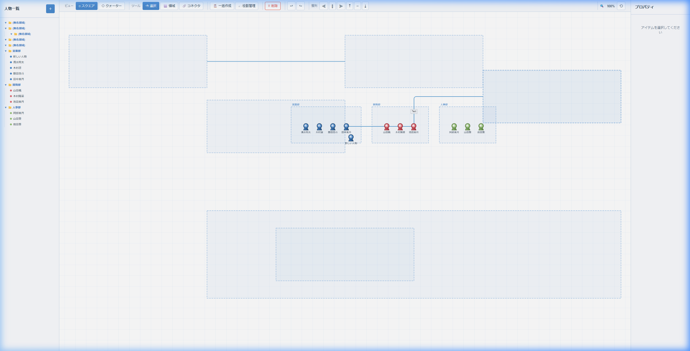
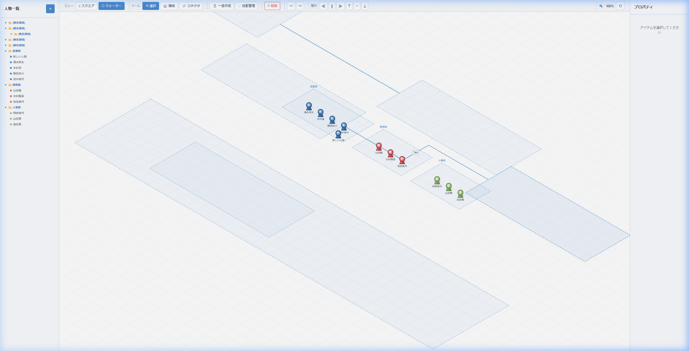
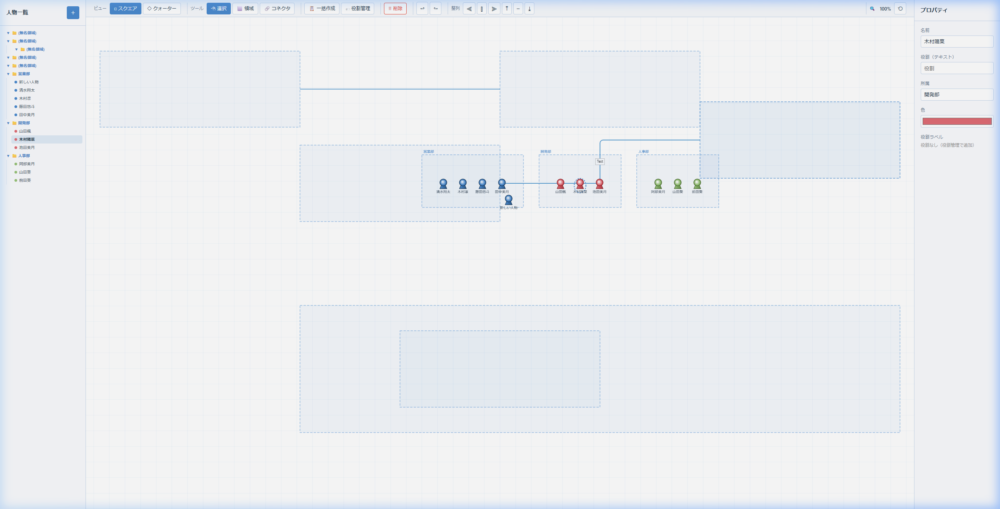

<p align="center">
  
</p>

<h1 align="center">🏢 組織図マネージャー</h1>

<p align="center">
  <strong>直感的に組織図を作成・編集できるインタラクティブWebアプリ</strong><br>
  サーバー不要。ブラウザだけで動作。データは自動保存。
</p>

<p align="center">
  
  
  
  
</p>

---

## ✨ デモ

### 📐 スクエアビュー — 標準的な組織図

部署を領域で囲み、人物をカラフルなアイコンで配置。コネクタで部署間の関係を可視化。


### 🔷 クォータービュー — 立体的なアイソメトリック表示

ワンクリックで立体的な俯瞰ビューに切り替え。奥行きのあるプロフェッショナルな見た目に。



### 🎨 プロパティ編集 — 直感的な操作

人物の名前・所属・色・役割をリアルタイムに編集。左のツリーは領域のネスト構造に自動同期。



---

## 🚀 特徴

<table>
<tr>
<td width="50%">

### 🖱️ 直感的な操作
- ドラッグ＆ドロップで自由配置
- 範囲選択で一括操作
- マウスホイールでズーム
- Undo / Redo（Ctrl+Z / Y）

</td>
<td width="50%">

### 📊 2つのビューモード
- **スクエア** — 正面からの標準ビュー
- **クォーター** — 立体的なアイソメトリック表示
- ワンクリックで即座に切り替え

</td>
</tr>
<tr>
<td>

### 🔗 コネクタ（関係線）
- 部署間をカギ状コネクタで接続
- ラベル付きで関係性を明示
- ウェイポイントで経路を自由に調整
- 矢印の方向を設定可能

</td>
<td>

### 🏷️ 役割管理
- カスタム役割を作成（名前・色・アイコン）
- 人物に複数役割を割り当て
- キャンバス上にバッジで表示

</td>
</tr>
<tr>
<td>

### 📋 一括データ入力
- タブ区切りリストから一括生成
- テストデータ自動生成機能
- 所属ごとに自動で領域を作成

</td>
<td>

### 🌲 ツリー構造サイドバー
- 領域のネストに自動同期
- 折りたたみ/展開可能
- クリックで即座に選択

</td>
</tr>
</table>

---

## 📦 セットアップ

### 必要なもの

- モダンブラウザ（Chrome / Edge / Firefox / Safari）
- 任意のHTTPサーバー

### 起動

```bash
# リポジトリをクローン
git clone https://github.com/YOUR_USERNAME/org_manager.git
cd org_manager

# Python の場合
python -m http.server 8765

# Node.js の場合
npx serve -p 8765
```

ブラウザで **http://localhost:8765** を開くだけ！

---

## 🎮 操作ガイド

| 操作 | 方法 |
|:-----|:-----|
| 👤 人物追加 | サイドバーの **＋** ボタン |
| ⬜ 領域作成 | 領域ツール → キャンバス上でドラッグ |
| 🔗 コネクタ | コネクタツール → 接続ポイント間をドラッグ |
| 🖱️ 移動 | 選択ツール → オブジェクトをドラッグ |
| ☐ 範囲選択 | 空白をドラッグ |
| 🔍 ズーム | マウスホイール |
| ✋ パン | 右ドラッグ |
| ↩ 元に戻す | `Ctrl + Z` |
| ↪ やり直し | `Ctrl + Y` |
| 🗑️ 削除 | `Delete` キー |
| 📋 全選択 | `Ctrl + A` |

---

## 🗂️ ファイル構成

```
org_manager/
├── index.html          # メインHTML
├── index.css           # スタイルシート
├── app.js              # アプリケーションロジック
├── docs/
│   └── images/         # スクリーンショット
├── enhance.txt         # エンハンスメント履歴
├── goal.txt            # プロジェクト目標
└── README.md
```

## 🛠️ 技術スタック

| 技術 | 用途 |
|:-----|:-----|
| **HTML5 Canvas** | 描画エンジン |
| **Vanilla JavaScript** | アプリケーションロジック |
| **CSS3** | UIスタイリング |
| **localStorage** | データ永続化（自動保存） |

> 🎯 **フレームワーク不使用** — 依存関係ゼロ。ブラウザだけで完結するピュアなWebアプリです。

---

## 📜 ライセンス

[MIT License](LICENSE) — 自由にご利用ください。

---

<p align="center">
  <sub>Built with ❤️ and vanilla JavaScript</sub>
</p>
