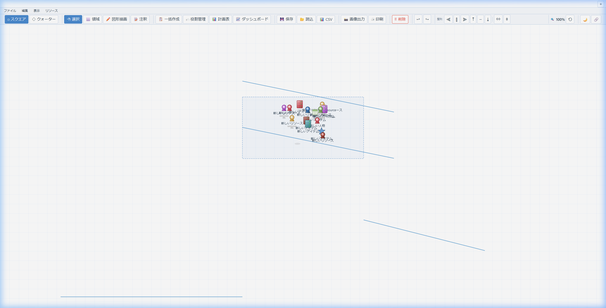
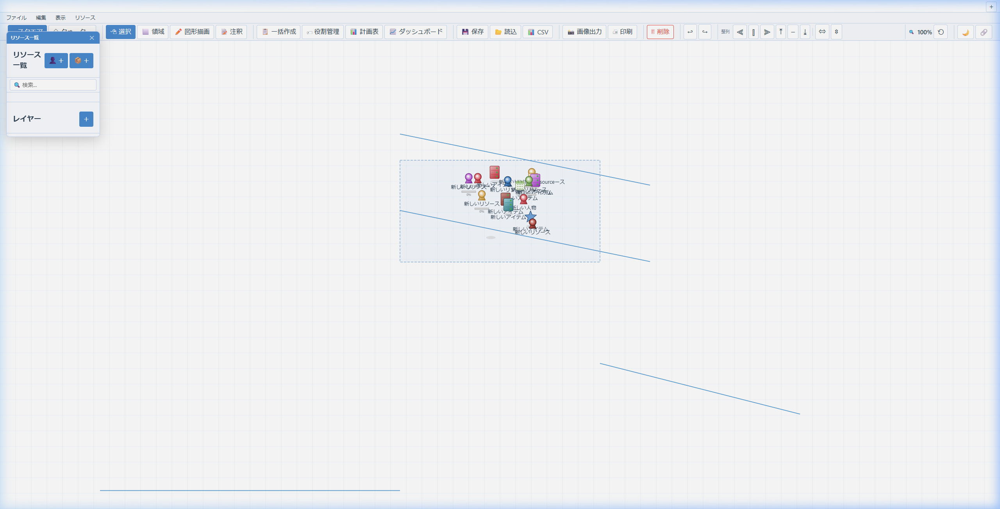
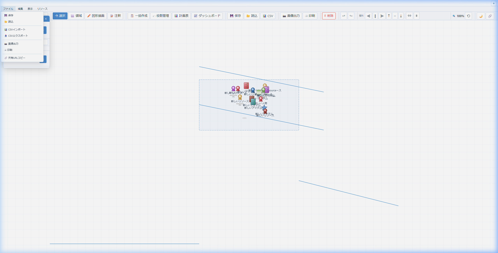
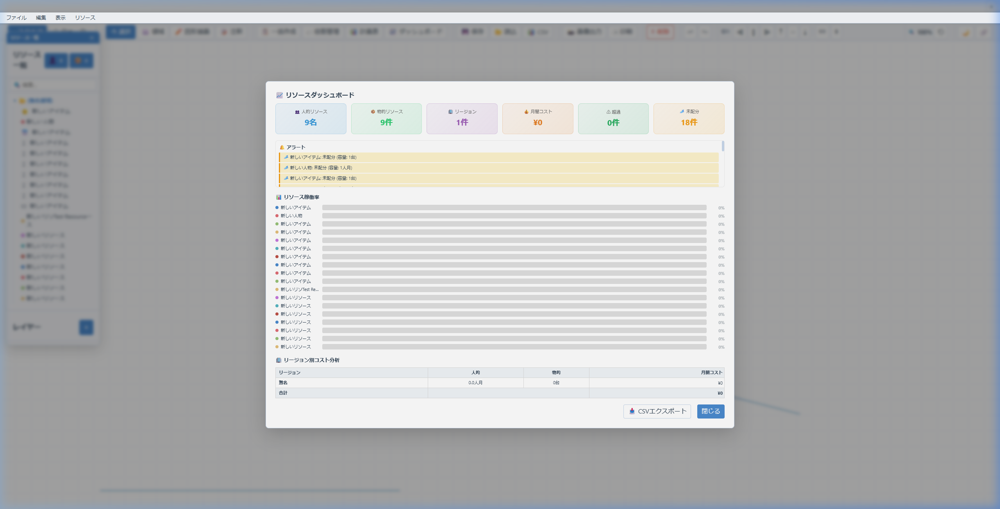

<p align="center">
  
</p>

<h1 align="center">📐 Stractal</h1>

<p align="center">
  <strong>Structure + Fractal — 構造をフラクタルに描く</strong><br>
  リソース配分・定量管理・抽象モデル作図ツール。サーバー不要、ブラウザだけで動作。
</p>

<p align="center">
  
  
  
  
  
</p>

---

## ✨ スクリーンショット

### 📐 メインキャンバス — フルワイドな作業領域

メニューバーとツールバーだけのミニマルUI。パネルは必要なときだけフローティング表示。


### 📋 フローティングパネル — 必要な時だけ表示

リソース一覧・レイヤー・プロパティをフローティングウィンドウで表示。ドラッグで自由移動。



### 🔷 クォータービュー — 立体的なアイソメトリック表示

ワンクリックで立体的な俯瞰ビューに切り替え。奥行きのあるプロフェッショナルな見た目に。


### 🗂 メニューバー — 整理されたアクセス

ファイル / 編集 / 表示 / リソースの4メニュー。ショートカットキー表示付き。



### 📈 ダッシュボード — リソース分析

KPIカード・稼働率チャート・リージョン別コスト分析・アラート・CSVエクスポート。



---

## 🚀 特徴

<table>
<tr>
<td width="50%">

### 🖱️ 直感的な操作
- ドラッグ＆ドロップで自由配置
- 範囲選択・Ctrl+Click で複数選択
- マウスホイールでズーム / 右ドラッグでパン
- Undo / Redo（Ctrl+Z / Y）
- コピー＆ペースト、整列、等間隔配置

</td>
<td width="50%">

### 📊 2つのビューモード
- **スクエア** — 正面からの標準ビュー
- **クォーター** — 立体的なアイソメトリック表示
- ワンクリックで即座に切り替え

</td>
</tr>
<tr>
<td>

### 📊 リソース管理
- **容量・単価・配分率** をリソースごとに設定
- リージョンへの配分先指定とコスト自動計算
- キャンバス上にミニ配分バー表示
- リージョン内リソースサマリー

</td>
<td>

### 📈 計画テーブル＆ダッシュボード
- **12ヶ月マトリクス** の期間別計画テーブル
- 期間別オーバーライドで月ごとの配分調整
- KPIカード・稼働率チャート・リージョン別コスト分析
- アラート表示（超過・未配分の自動検出）
- CSVエクスポート

</td>
</tr>
<tr>
<td>

### 🗂 メニューバー＆フローティングパネル
- **ファイル / 編集 / 表示 / リソース** の4メニュー
- パネルは初期非表示、メニューから表示切替
- フローティングウィンドウでドラッグ移動可能
- リソース選択時にプロパティパネル自動表示

</td>
<td>

### ✏️ 図形描画・コネクタ
- 直線・カギ直線・矢印を自由描画
- 領域間をコネクタで接続
- ラベル付き、ウェイポイント経路編集
- 選択・移動・再編集可能

</td>
</tr>
<tr>
<td>

### 🏷️ 役割管理 / 📂 レイヤー / 📑 タブ
- カスタム役割（名前・色・アイコン）をバッジ表示
- レイヤーごとの表示/非表示・ロック
- タブごとに独立した配置データ管理

</td>
<td>

### 💾 データ管理・エクスポート
- JSON保存/読込、CSVインポート
- PNG高解像度エクスポート
- 共有URL、印刷対応（A3/A4）
- localStorage自動保存
- 🌙 ダークモード

</td>
</tr>
</table>

---

## 📦 セットアップ

### 必要なもの

- モダンブラウザ（Chrome / Edge / Firefox / Safari）
- **それだけ！** サーバーは不要です

### 起動

```bash
git clone https://github.com/yet103/stractal.git
cd stractal
```

**`index.html` をダブルクリック** で起動！🎉

> 💡 HTTPサーバー経由でも利用できます：
> ```bash
> python -m http.server 8765    # Python
> npx serve -p 8765             # Node.js
> ```

---

## 🎮 操作ガイド

### キーボードショートカット

| キー | 動作 |
|:-----|:-----|
| `Ctrl + Z / Y` | 元に戻す / やり直し |
| `Ctrl + A` | 全選択 |
| `Ctrl + S` | ファイル保存 |
| `Ctrl + C / V / D` | コピー / 貼り付け / 複製 |
| `Ctrl + F` | 検索バーにフォーカス |
| `Ctrl + +/-/0` | ズームイン / アウト / リセット |
| `Escape` | 選択解除 / ツールリセット |
| `Delete` | 選択削除 |
| `↑↓←→` | 微移動（Shift で大きく） |

---

## 🗂️ ファイル構成

```
stractal/
├── index.html          # メインHTML
├── index.css           # スタイルシート
├── app.js              # アプリケーションロジック
├── docs/images/        # スクリーンショット
├── LICENSE             # MIT License
└── README.md
```

## 🛠️ 技術スタック

| 技術 | 用途 |
|:-----|:-----|
| **HTML5 Canvas** | 描画エンジン |
| **Vanilla JavaScript** | アプリケーションロジック |
| **CSS3** | UIスタイリング（ダークモード対応） |
| **localStorage** | データ永続化（自動保存） |

> 🎯 **フレームワーク不使用** — 依存関係ゼロ。ブラウザだけで完結するピュアなWebアプリです。

---

## 🚀 すぐに使う

### ▶ オンラインで使う（GitHub Pages）

**https://yet103.github.io/stractal/**

### ▶ ダウンロードして使う

| バージョン | リンク | 日付 |
|:--|:--|:--|
| **v2.0.0**（最新） | [📥 ZIPダウンロード](https://github.com/yet103/stractal/archive/refs/tags/v2.0.0.zip) | 2026-04-18 |
| 最新開発版 | [ZIPダウンロード（main）](https://github.com/yet103/stractal/archive/refs/heads/main.zip) | — |

---

## 📋 更新履歴

### v2.0.0（2026-04-18）— Stractal リブランド
- 🎨 **Stractal（Structure + Fractal）にリブランド**
- 📊 **リソース管理** — 容量・単価・配分率、コスト自動計算、キャンバス配分バー
- 📈 **計画テーブル** — 12ヶ月マトリクス、期間別オーバーライド
- 📈 **ダッシュボード** — KPIカード、稼働率チャート、リージョン別コスト分析、アラート、CSVエクスポート
- 🗂 **メニューバー** — ファイル/編集/表示/リソースのドロップダウンメニュー
- 🪟 **フローティングパネル** — サイドバー初期非表示、メニューから表示切替、ドラッグ移動
- 📦 **37アイコン** — 5カテゴリ（システム/ネットワーク/オフィス/文房具/汎用）

### v1.5.x〜v1.6.0（2026-04-15〜17）
- アイテム配置（非人物オブジェクト）、図形描画ツール、レイヤー・タブ管理、注釈機能拡張

### v1.0.0〜v1.4.0（2026-03-03〜04-15）
- Canvas描画エンジン、スクエア/クォータービュー、コネクタ、役割管理、整列、キーボードショートカット

---

## 📜 ライセンス

[MIT License](LICENSE) — 自由にご利用ください。

---

<p align="center">
  <sub>Built with ❤️ and vanilla JavaScript</sub>
</p>
